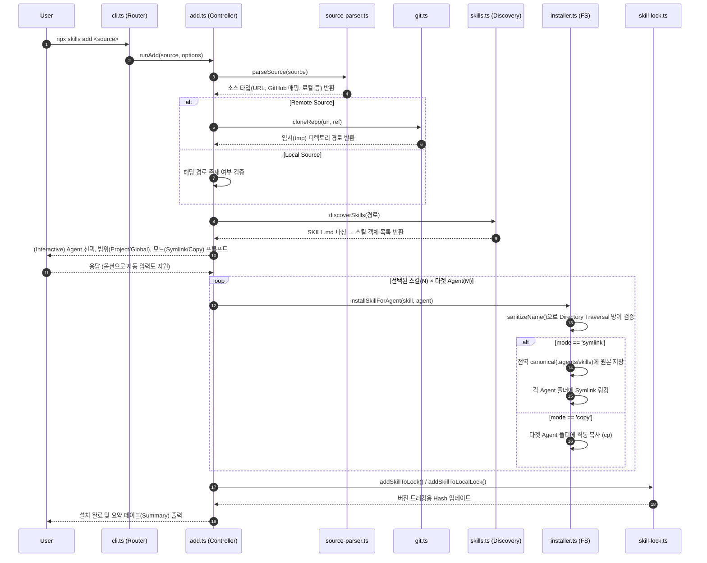

## 프로젝트 분석 결과: skills (agent-skills CLI)

### 기술 스택

- 언어: TypeScript
- 프레임워크: Node.js (CLI 도구)
- 테스트: vitest
- 빌드: obuild
- 주요 의존성: `@clack/prompts` (CLI 인터랙션), `picocolors` (터미널 색상), `simple-git` (git 조작), `husky`, `lint-staged`

### 실제 디렉토리 구조 (탐색 결과)

```
.
├── bin/
│   └── cli.mjs (빌드된 CLI의 실제 실행 엔트리포인트 파일)
├── scripts/
│   └── (라이선스 생성 등 자동화 스크립트 모음)
├── src/
│   ├── cli.ts (주요 명령어 라우터: skills add, skills remove 등 분기)
│   ├── add.ts (skills add 명령어 구현 핵심 로직)
│   ├── remove.ts (skills remove 명령어 구현 핵심 로직)
│   ├── list.ts (설치된 스킬 목록 조회 구현 로직)
│   ├── find.ts (스킬 검색/탐색 명령어 로직)
│   ├── installer.ts (실제 파일시스템의 .agents 폴더 등에 스킬을 복사하거나 심볼릭 링크를 생성하는 코어 로직)
│   ├── agents.ts (호환되는 AI 에이전트 종류 탐지 및 정의)
│   ├── skills.ts (스킬 메타데이터 구문 분석 및 디렉토리 크롤링)
│   ├── skill-lock.ts (글로벌 스킬 설치 기록 ~/.agents/.skill-lock.json 관리를 담당)
│   ├── local-lock.ts (프로젝트 로컬 설치 기록을 관리)
│   ├── source-parser.ts (입력받은 패키지명, git URL, 로컬 경로 등을 분석 및 매핑)
│   ├── telemetry.ts (CLI 사용성에 대한 익명 데이터 수집 모듈)
│   ├── providers/
│   │   └── (원격 제공자 리포지토리(GitHub, well-known 등)와 연동하는 하위 로직 모음)
│   └── prompts/
│       └── (터미널에서의 검색이나 다중선택 CLI 프롬프트 UI 지원 파일 모음)
└── tests/
    └── (기능 및 주요 알고리즘들에 대한 통합 테스트 코드 모음)
        ├── installer-symlink.test.ts
        ├── source-parser.test.ts 등
```

### 엔트리포인트

- `src/cli.ts`: `main()` 함수에서 커맨드라인 인자(process.argv)를 파싱하고 각 기능 파일(`add.ts`, `remove.ts`, `sync.ts` 등)의 함수로 분기(routing)합니다. 여기서 명령어 헬프(help) 화면과 버전 정보를 함께 출력합니다.

### Call Flow (핵심 기능)

**명령어 `skills add <package>`의 호출 흐름**:

1. `src/cli.ts` (명령어 파싱 후 `runAdd()` 호출)
2. `src/add.ts > runAdd()` (사용자 프롬프트 처리, 옵션 해석)
3. `src/source-parser.ts > parseSource()` (GitHub URL, URL 또는 패키지명 등 입력 소스를 실제 다운로드할 위치로 해석)
4. (로컬/깃의 경우) `src/git.ts > cloneRepo()` 또는 `providers` (실제 대상 저장소/URL에서 에셋 다운로드)
5. `src/agents.ts > detectInstalledAgents()` (어떤 AI 코딩 에이전트가 설치되어 있는지 자동 식별 및 타겟 설정)
6. `src/installer.ts > installSkillForAgent()` (복사/Symlink 여부 판단 후 타겟 디렉토리에 생성)
7. `src/skill-lock.ts > addSkillToLock()` (실행 완료 정보 및 다운로드 폴더 해시를 lock 파일에 덮어쓰기)

### 기능 추가 계획

새로운 CLI 명령어, 예: `skills info <package>`를 추가한다고 가정할 경우:

- 삽입 지점: `src/cli.ts` 의 `switch (command)` 구문과 신규 파일 `src/info.ts` 의 조합
- 필요한 파일:
  - 신규 생성: `src/info.ts`, `tests/info.test.ts`
  - 기존 수정: `src/cli.ts`에 분기 추가, (필요시) `src/source-parser.ts` 내 정보 조회 로직 재사용
- 예상 작업 순서:
  1. `src/add.ts`를 복사하여 `src/info.ts` 뼈대를 작성
  2. `src/info.ts` 내부의 `installSkillForAgent` (파일 쓰기) 로직 부분을 제거하고, 콘솔 출력 형태(info)로 대체 변경
  3. `src/cli.ts`에서 커맨드 `case 'info': await runInfo(restArgs); break;` 라우팅 추가
  4. 테스트 파일 생성하여 `vitest` 로 로직 격리 검증 (`pnpm test tests/info.test.ts`)

### 주의사항

- **TypeScript 상대 경로 Import**: 파일 import 시 확장자 `.ts`를 명시하는 ESM 방식을 취하고 있습니다. (예: `import { x } from './agents.ts'`)
- **보안 검증**: 로컬 경로 탐색 공격(Directory Traversal)을 막기 위해 `src/installer.ts` 로직에 `sanitizeName`과 `isPathSafe`를 철저히 사용해 타겟 경로를 생성합니다. 기능 확장 시 이를 임의로 우회하지 않도록 각별히 유의해야 합니다.
- **포맷팅**: `pnpm format` (Prettier 기반) 이 강제 적용된 프로젝트입니다. 이를 위반하면 CI 환경에서 실패하므로 작업 완료 후 커밋 전 필수 실행해야 합니다.

Ran command: `npm install . `
Searched for "export async function runAdd"
Searched for "runAdd"
Searched for "runAdd"
Viewed add.ts:885-1100
Viewed add.ts:1100-1400
Searched for "export.\*removeCommand"
Searched for "removeCommand"

앞서 진행된 `project-analysis.md` 파일 구조와 소스 코드를 바탕으로 이 프로젝트(`skills` CLI)의 핵심이자 가장 복잡한 로직인 **`skills add <package>` 커맨드의 Call Flow**를 심층 분석해 드립니다.

이 CLI 애플리케이션 안에서 어떻게 깃헙 리포지토리나 로컬 경로의 스킬이 파싱되고, 사용자의 로컬 환경 코딩 에이전트 폴더(`.cursor/`, `.claude/` 등)에 심볼릭 링크나 직접 복사 방식으로 설치되는지 추적한 결과입니다.

---

### 1. `skills add` 핵심 모듈 분업 다이어그램

가장 중심이 되는 `skills add`의 전체 흐름은 아래의 시퀀스 다이어그램과 같습니다.



---

### 2. 세부 단계별(Phase) 흐름 추적

#### Phase A: 입력값 해석 및 다운로드 (Input Parsing & Fetching)

1. **진입점**: 프로세스가 `src/cli.ts`에서 시작되며, Argument 파싱 후 `runAdd()` (`src/add.ts`)를 호출합니다.
2. **소스 종류 식별**: `parseSource()`(`source-parser.ts`) 함수는 입력 문자열이 `owner/repo` 형태라면 깃허브 URL로 변환하고, 특정 브랜치/태그 식별자(`@`) 등을 분리해 냅니다. 만약 `.well-known` 규약을 따르는 제공자라면 `providers` 폴더의 로직으로 위임합니다.
3. **클론 및 임시 저장**: 외부 저장소의 경우 `git.ts` 내부의 `cloneRepo()`를 통해 빠른 얕은 복사(shallow clone)를 통해 로컬의 임시 폴더(`tempDir`)에 코드를 위치시킵니다.

#### Phase B: 스킬 탐색 (Skill Discovery)

1. **파일 시스템 횡단**: `skills.ts:discoverSkills()` 코드가 실행되며 다운로드된 임시 폴더(또는 로컬 폴더)의 디렉토리를 순회합니다.
2. **메타데이터 파싱**: 이때 `SKILL.md` 파일을 찾아 내부의 YAML 프론트매터(Frontmatter)를 분석하고, 이름과 설명을 추출합니다. (발견된 각 스킬들은 개별 `Skill` 객체로 포장되어 반환됩니다.)

#### Phase C: 설치 대상 및 방법 결정 (Interaction & Agent Detection)

1. `agents.ts:detectInstalledAgents()`를 호출해 대상 PC에 `.cursor`, `.claude`, `.roo` 등 어떤 폴더들이 활성화되어 있는지 자동 검출합니다.
2. `@clack/prompts` 라이브러리를 활용해 콘솔 UI를 띄워 **어느 에이전트에 설치할 것인지**, 전역(Global) 공간인지 프로젝트 내부(Project) 공간인지 묻습니다.
3. 대상 디렉터리가 여러 개인 경우 **symlink (추천)** 와 **copy (단독 복사)** 방식 중 하나를 사용자에게 선택받게 합니다.

#### Phase D: 파일 생성 및 락 지정 (Installation & Locking)

1. **보안 및 설치 (`installer.ts`)**: `installSkillForAgent()`에서 Directory Traversal(`../../` 등) 공격을 예방하기 위해 먼저 `sanitizeName()`을 거칩니다. 이후 "symlink" 모드일 때는 `~/.agents/skills/` 캐시에 원본을 둔 다음 각 에이전트 전용 디렉터리에 링크를 만들고 "copy"일 때는 곧장 각 폴더 안에 스킬 파일을 복제시킵니다.
2. **Lock 파일 갱신 (`skill-lock.ts`)**: 설치된 스킬의 상태를 기록하여 차후 `skills update` 및 `skills check` 명령 실행 시 해당 폴더의 깃허브 트리(tree) Hash 값을 비교할 수 있게 합니다.

---

### 💡 아키텍처 관점에서의 통찰(Insight)

1. **관심사의 분리**: 라우팅(`cli.ts`), 다운로드(`git.ts/source-parser.ts`), 검색(`skills.ts`), 디스크 IO 작업 방어와 실행(`installer.ts`)의 경계가 매우 깔끔하게 나누어져 있습니다. 기능 추가나 코드를 고쳐야 한다면 흐름도에 맞춰 해당하는 작은 파일만 건드리면 됩니다. (예: `AI 에이전트`를 추가하고 싶다면 `agents.ts`만 수정하면 됨)
2. **`check/update` 효율성**: `update` 요청 시 전체 코드를 다시 클론하지 않고 `skill-lock.ts:fetchSkillFolderHash()` 함수가 GitHub API에서 폴더 단위 `SHA` 값만 가져오도록 설계해 GitHub 레이트 리밋(Rate Limit)을 영리하게 우회하고 있습니다.

이 분석을 바탕으로, 혹시 새로 추가해보고 싶은 명령어나 확장하고 싶은 기능이 있으신가요?
